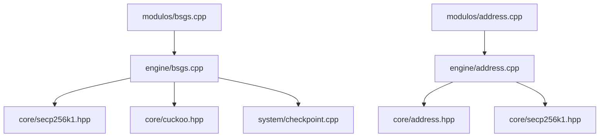

# 🏗️ Arquitetura do Sistema

O **Bchaves** utiliza uma arquitetura em camadas projetada para performance e modularidade. Abaixo está a explicação de cada diretório e seu papel no ecossistema.

## 📂 Estrutura de Diretórios

### 1. `core/` (Fundamentos e Primitivos)
Esta é a base do sistema. Contém implementações que não possuem lógica de "negócio" de busca, mas sim as ferramentas necessárias para que ela ocorra.
- **`address.cpp/hpp`**: Lógica para derivação de endereços Bitcoin (Hash160, Base58).
- **`secp256k1.cpp/hpp`**: Operações em curvas elípticas (Jacobian, multiplicação escalar).
- **`cuckoo.hpp`**: Filtro de alta performance usado para buscas ultra-rápidas.
- **`bigint.hpp`**: (Geralmente integrado no secp256k1) Aritmética de precisão arbitrária otimizada para 256 bits.

### 2. `engine/` (Motores de Busca)
Contém a lógica pesada de "como encontrar a chave". É aqui que os algoritmos de busca são implementados.
- **`address.cpp`**: Motor de busca sequencial baseado em endereços públicos.
- **`bsgs.cpp`**: Algoritmo Baby-Step Giant-Step.
- **`kangaroo.cpp`**: Algoritmo Pollard's Kangaroo.
- **`app.hpp`**: Cabeçalho comum para estados globais do motor.

### 3. `modulos/` (Pontos de Entrada)
Arquivos pequenos que servem apenas como "wrappers" para criar binários diferentes.
- Cada arquivo contém um `main()` que parseia os argumentos da linha de comando e delega a execução para o motor correspondente na `engine/`.

### 4. `system/` (Utilidades do SO)
Gerenciamento de recursos do sistema e I/O.
- **`checkpoint.cpp`**: Persistência de progresso em arquivos `.ckp`.
- **`hardware.cpp`**: Detecção de CPU, núcleos e memória RAM disponível.
- **`cli.cpp`**: Interpretador de argumentos de linha de comando.
- **`targets.cpp`**: Carregamento eficiente de arquivos de texto com milhares de endereços/chaves.

### 5. `traps/` e `puzzles/`
- **`traps/`**: Diretório usado pelo motor Kangaroo para despejar dados da memória no disco (NVMe) quando a RAM está cheia.
- **`puzzles/`**: Arquivos de configuração e alvos (hashes/endereços) para desafios específicos.

---

## 🔄 Fluxo de Dependências

## 🧩 Por que a separação?
A separação entre `core` e `engine` permite que o desenvolvedor otimize a matemática elíptica (no `core`) sem quebrar a lógica de multi-threading da busca (na `engine`). Além disso, facilita a criação de novos módulos de entrada sem duplicar código.
