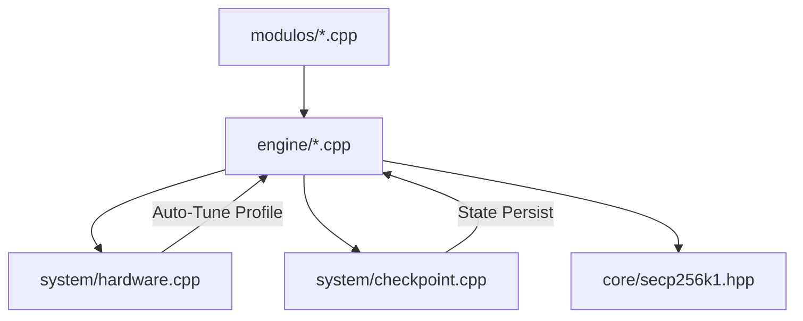

# 🏗️ Arquitetura do Sistema

O **Bchaves** utiliza uma arquitetura em camadas projetada para performance e modularidade. Abaixo está a explicação de cada diretório e seu papel no ecossistema.

## 📂 Estrutura de Diretórios

### 1. `core/` (Fundamentos Zero-Allocation)
Esta é a base do sistema, projetada para ter **zero alocações de heap** no loop crítico.
- **`secp256k1.cpp/hpp`**: Operações em curvas elípticas Jacobianas com otimização **GLV**. Funções de serialização redesenhadas para usar buffers locais.
- **`address.cpp/hpp`**: Lógica para derivação de endereços Bitcoin, agora suportando **SegWit (Bech32)** e **P2SH**.
- **`cuckoo.hpp`**: Filtro probabilístico de alta densidade.

### 2. `engine/` (Motores de Busca)
Contém a lógica pesada de "como encontrar a chave". É aqui que os algoritmos de busca são implementados.
- **`address.cpp`**: Motor de busca de endereços unificado. Implementa o modo **Linear** (Standard) e o modo **Hybrid** (LCG Partitioned).
- **`bsgs.cpp`**: Algoritmo Baby-Step Giant-Step com gerenciamento de shards e Cuckoo Filter.
- **`kangaroo.cpp`**: Pollard's Kangaroo com modelo de frota distribuída.
- **`app.hpp`**: Cabeçalho comum para estados globais do motor.

### 3. `modulos/` (Pontos de Entrada)
Arquivos pequenos que servem apenas como "wrappers" para criar binários diferentes.
- Cada arquivo contém um `main()` que parseia os argumentos da linha de comando e delega a execução para o motor correspondente na `engine/`.

### 4. `system/` (Utilidades do SO)
Gerenciamento de recursos do sistema e I/O.
- **`checkpoint.cpp`**: Persistência de progresso em arquivos binários **v5**. Suporta salvamento de estado de chunks para buscas pseudoaleatórias.
- **`hardware.cpp`**: Detecção avançada de CPU (CPUID Leaf 4) e lógica de **Auto-Tune**. Calcula o número ideal de threads e lotes conforme o Perfil de Hardware (`safe`, `balanced`, `max`).
- **`targets.cpp`**: Carregador de alvos polimórfico para endereços Legados, P2SH, SegWit e Hash160.

### 5. `traps/` e `puzzles/`
- **`traps/`**: Diretório usado pelo motor Kangaroo para despejar dados da memória no disco (NVMe) quando a RAM está cheia.
- **`puzzles/`**: Arquivos de configuração e alvos (hashes/endereços) para desafios específicos.

---

## 🔄 Fluxo de Dependências

## 🧩 Por que a separação?
A separação entre `core` e `engine` permite que o desenvolvedor otimize a matemática elíptica (no `core`) sem quebrar a lógica de multi-threading da busca (na `engine`). Além disso, facilita a criação de novos módulos de entrada sem duplicar código.
